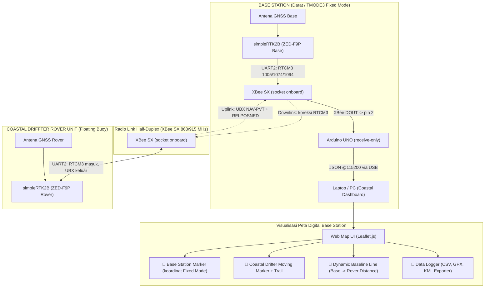

# Coastal Driffter - RTK GNSS Drifter Telemetry System

Dokumentasi utama proyek **Coastal Driffter**: sistem drifter pantai/laut berbasis modul **simpleRTK2B (u-blox ZED-F9P)** RTK GNSS, radio **XBee SX** long-range, dan **Web Map Dashboard Real-Time** yang memetakan posisi **Base Station** dan pergerakan **Rover** secara live.

Arsitektur memanfaatkan fakta bahwa socket XBee simpleRTK2B tersambung ke **UART2 ZED-F9P**, sehingga koreksi RTCM3 dan telemetri UBX mengalir langsung antar-receiver tanpa perantara mikrokontroler di sisi Rover.

---

## 📑 Daftar Isi
1. [Gambaran Umum & Arsitektur Dual-GNSS](#1-gambaran-umum--arsitektur-dual-gnss)
2. [Spesifikasi Hardware & Pinout Wiring](#2-spesifikasi-hardware--pinout-wiring)
3. [Format Data Telemetri](#3-format-data-telemetri)
4. [Tingkat Akurasi & Mode Operasi RTK GNSS](#4-tingkat-akurasi--mode-operasi-rtk-gnss)
5. [Firmware STM32 & Arduino Rover/Base](#5-firmware-stm32--arduino-roverbase)
6. [Visualisasi Peta & Data Logger Dual-GNSS](#6-visualisasi-peta--data-logger-dual-gnss)
7. [Panduan Uji Jangkauan Radio (Field Range Test)](#7-panduan-uji-jangkauan-radio-field-range-test)

Panduan setup langkah demi langkah: **`guide.md`**. Glosarium teori GNSS/RTK: **`technical_terms.md`**.

---

## 1. Gambaran Umum & Arsitektur Dual-GNSS

**Coastal Driffter** dirancang untuk melacak pergerakan arus air laut/pantai, dinamika gelombang, dan posisi permukaan air dengan presisi tinggi.



### Keputusan Desain: Rover Tanpa MCU

Socket XBee pada simpleRTK2B tersambung ke **UART2 ZED-F9P**. Konsekuensinya, ZED-F9P Rover dapat menerima RTCM3 dan mengirim UBX melalui UART2 yang sama — **Rover tidak memerlukan mikrokontroler sama sekali**, dan RTCM3 tidak pernah melewati Arduino.

| Aspek | Implikasi |
|---|---|
| **Arduino Base** | Cukup satu `SoftwareSerial` **receive-only** pada pin 2. Tidak ada relay RTCM3, tidak ada `listen()` bergantian. |
| **Base GNSS ke Arduino** | Tidak disambung. Posisi Base sudah konstan dari TMODE3 Fixed Mode dan ditulis sebagai konstanta di firmware. |
| **Arduino Rover** | Tidak dipakai. `Arduino_Rover/Arduino_Rover.ino` adalah referensi Fase 8 (kalau IMU dibutuhkan). |
| **Data IMU** | **Tidak tersedia** pada arsitektur ini. Field `pitch`/`roll` selalu `0.0`. |

> ⚠️ Kalau nanti IMU dibutuhkan: di board Rover, net XBee DIN sudah didrive oleh ZED-F9P TX2. Menambahkan Arduino sebagai driver kedua pada net yang sama tidak reliabel dan berpotensi merusak pin. Jalur TX2 → XBee DIN harus diputus lebih dulu.

---

## 2. Spesifikasi Hardware & Pinout Wiring

### A. Komponen Utama
* **Microcontroller Base**: Arduino UNO (saat ini) — rencana migrasi ke STM32 Nucleo-64.
* **GNSS Engine**: Dual simpleRTK2B Board (u-blox ZED-F9P multi-band RTK).
* **Wireless Transceiver**: 2x XBee SX 868/915 MHz (long range), terpasang di socket onboard simpleRTK2B → UART2.
* **Motion Sensor**: IMU — **belum terpasang**, lihat catatan Fase 8 di atas.

### B. Baud Rate — Harus Konsisten

Mismatch baud adalah penyebab kegagalan paling sering. Nilai berikut harus **identik** di keempat titik:

| Titik | Nilai |
|---|---|
| UART2 ZED-F9P Base | 19200 |
| XBee SX Base (parameter `BD`) | 19200 |
| XBee SX Rover (parameter `BD`) | 19200 |
| UART2 ZED-F9P Rover | 19200 |
| `RADIO_BAUD` di `Arduino_Base.ino` | 19200 |
| USB Serial Base → Dashboard | 115200 |

---

## 3. Format Data Telemetri

### Output Dual-GNSS JSON di Base Station (ke Laptop Dashboard)

`Arduino_Base.ino` menggabungkan koordinat Base (konstanta hasil Fixed Mode) dengan paket UBX Rover menjadi JSON @1 Hz:

```json
{
  "base": {
    "valid": 1,
    "lat": -6.1753924,
    "lon": 106.8271532,
    "alt": 15.420
  },
  "rover": {
    "id": 1,
    "link_ok": 1,
    "lat": -6.1754100,
    "lon": 106.8272100,
    "alt": 15.500,
    "fix": 4,
    "hAcc_cm": 1.2,
    "speed_kmh": 14.50,
    "heading": 128,
    "pitch": 0.0,
    "roll": 0.0,
    "relN_m": 42.15,
    "relE_m": 18.70
  }
}
```

| Field | Arti |
|---|---|
| `base.valid` | `0` = Base belum dikonfigurasi Fixed Mode. Dashboard **tidak** menggambar marker Base, menampilkan mode Rover-only. Mencegah titik palsu yang tampak sah. |
| `rover.link_ok` | `0` = tidak ada UBX valid dari Rover >3 detik. Membedakan "Rover diam" dari "radio drop". |
| `pitch` / `roll` | Selalu `0.0` — IMU butuh MCU di Rover (Fase 8). |

---

## 4. Tingkat Akurasi & Mode Operasi RTK GNSS

### A. Akurasi Nominal Receiver (Baseline Pendek, < 1 km)

Angka berikut adalah spesifikasi ZED-F9P pada kondisi ideal — baseline pendek, clear sky, multipath minimal:

| Mode Operasi | Kode `fix` | Akurasi Horizontal | Akurasi Vertikal | Kondisi |
|---|---|---|---|---|
| **RTK FIX** | `4` | $1.0\text{ cm} + 1\text{ ppm}$ | $1.5\text{ cm} + 1\text{ ppm}$ | Integer ambiguity terkunci, RTCM3 lancar |
| **RTK FLOAT** | `5` | $10\text{ cm} - 50\text{ cm}$ | $20\text{ cm} - 80\text{ cm}$ | Koreksi diterima, ambiguity belum terkunci |
| **3D Fix / Autonomous** | `1` | $1.5\text{ m} - 2.5\text{ m}$ | $2.5\text{ m} - 5.0\text{ m}$ | Radio putus atau Base belum siap |
| **No Fix** | `0` | — | — | Belum lock satelit |

### B. Degradasi Terhadap Panjang Baseline

RTK bersandar pada asumsi bahwa error atmosfer di Base dan Rover **berkorelasi sempurna**. Asumsi ini melemah seiring jarak (lihat `technical_terms.md` §4 dan §5). Suku $1\text{ ppm}$ pada tabel di atas berarti tambahan $1\text{ mm}$ error per $1\text{ km}$ baseline — tetapi kontribusi ini **bukan** faktor dominan. Yang dominan adalah menurunnya kemampuan mengunci integer ambiguity:

| Baseline | Ekspektasi Realistis | Catatan |
|---|---|---|
| **< 1 km** | RTK FIX konsisten, 1-2 cm | Kondisi acuan untuk verifikasi konfigurasi |
| **1 - 5 km** | RTK FIX dominan, sesekali turun ke FLOAT | Masih andal untuk sebagian besar aplikasi |
| **5 - 10 km** | **RTK FLOAT dominan, 10-50 cm** | Dekorelasi ionosfer/troposfer mulai signifikan. FIX mungkin tercapai tetapi tidak dapat diandalkan bertahan. |
| **> 10 km** | FLOAT tidak stabil hingga Autonomous | Di luar rentang wajar RTK single-baseline |

> ⚠️ **Ekspektasi untuk deployment target (> 5 km): RTK FLOAT, akurasi 10-50 cm.** Ini tetap jauh lebih baik daripada GNSS single (1.5-2.5 m) dan memadai untuk pelacakan arus permukaan. Namun **jangan mengklaim akurasi 1-2 cm** pada baseline sejauh ini dalam laporan atau publikasi — klaim tersebut tidak dapat dipertahankan.

Ukur dan laporkan `hAcc` aktual dari `UBX-NAV-PVT`. Perhatikan bahwa `hAcc` adalah estimasi **CEP (50%)**; untuk pelaporan pada tingkat kepercayaan 95%, kalikan sekitar $2.4$.

### C. Faktor Pembatas: Bandwidth Radio

Pada mode long-range, throughput XBee SX turun drastis. Anggaran bandwidth (perkiraan, **wajib diukur di lapangan**):

| Arah | Isi | Perkiraan |
|---|---|---|
| Downlink | RTCM3 1005 @0.1 Hz + 1074 + 1094 @1 Hz (GPS + Galileo, MSM4) | ~400-600 B/s |
| Uplink | UBX NAV-PVT (92 B) + NAV-RELPOSNED (64 B) @1 Hz + overhead | ~172 B/s |

Konfigurasi ini sengaja **tidak** memakai MSM7, dan **tidak** mengaktifkan GLONASS/BeiDou (1084/1124/1230) — penghematan bandwidth terbesar yang tersedia. Kalau pengukuran menunjukkan link masih saturasi, urutan penurunan: buang 1094 (GPS-only) → NAV-PVT/RELPOSNED ke 0.5 Hz → 1074 ke 0.5 Hz.

> ⚠️ **Regulasi frekuensi**: 868 MHz adalah alokasi Eropa. Indonesia mengalokasikan pita SRD di sekitar 920-923 MHz. Verifikasi varian modul dan aturan Komdigi yang berlaku sebelum deployment lapangan, terutama untuk penelitian yang akan dipublikasikan.

---

## 5. Firmware STM32 & Arduino Rover/Base

| File | Status | Peran |
|---|---|---|
| **`Arduino_Base/Arduino_Base.ino`** | ✅ **Aktif** | Satu `SoftwareSerial` receive-only pada pin 2. Mem-parse UBX `NAV-PVT` + `NAV-RELPOSNED` dari Rover via XBee, menggabungkan dengan koordinat Base (konstanta Fixed Mode), mengeluarkan JSON @1 Hz ke USB. |
| **`Arduino_Rover/Arduino_Rover.ino`** | ⏸️ **Referensi Fase 8** | **Jangan di-upload.** Rover tidak butuh MCU pada arsitektur UART2. Baru relevan kalau IMU dibutuhkan, dan memerlukan modifikasi hardware (putus TX2 → XBee DIN). |
| **`default.ino`** | 🔧 Utilitas | Passthrough sederhana untuk uji NMEA. |
| **`xbee_test_sender.ino` / `xbee_test_receiver.ino`** | 🔧 Utilitas | Uji link XBee terisolasi, lihat `xbee_test.md`. |
| **`Refrensi/STM32 Nucleo 64/`** | 📚 Referensi | Kode ArduSimple berbasis STM32 HAL (`gnss.c`, `hardware.c`, `tasks.c`). Acuan untuk migrasi STM32. |

### Konfigurasi Wajib Sebelum Upload

`Arduino_Base.ino` memiliki tiga konstanta yang **harus** diisi setelah Survey-In selesai:

```cpp
#define BASE_CONFIGURED 0     // -> 1 setelah koordinat di bawah diisi
#define BASE_LAT_1E7 0L       // lat  x 1e7 hasil Fixed Mode
#define BASE_LON_1E7 0L       // lon  x 1e7 hasil Fixed Mode
#define BASE_ALT_MM  0L       // alt dalam mm
```

Selama `BASE_CONFIGURED 0`, dashboard berjalan dalam mode Rover-only dan tidak menggambar marker Base. Ini disengaja — lebih baik tidak ada titik daripada titik palsu.

### Pemakaian Resource (Arduino UNO / ATmega328P)

| Sketch | Flash | RAM Global |
|---|---|---|
| `Arduino_Base.ino` | 6.814 B (21%) | 469 B (22%) |
| `Arduino_Rover.ino` | 4.252 B (13%) | 606 B (29%) |

---

## 6. Visualisasi Peta & Data Logger Dual-GNSS

File `map_dashboard.html` menyediakan antarmuka pemantauan interaktif berbasis **Leaflet.js** dan **Web Serial API** (Chrome/Edge saja).

### Fitur Web Dashboard:
- 📌 **Base Station Marker**: Titik Base dari koordinat Fixed Mode. Disembunyikan otomatis kalau `base.valid = 0`.
- 🚤 **Rover Real-Time Tracking**: Penanda pergerakan drifter beserta garis lintasan (*trail line*).
- 📏 **Baseline Line & Distance**: Garis putus-putus Base → Rover dengan jarak real-time. Tampilan otomatis beralih ke satuan km untuk baseline panjang.
- 🔗 **Indikator LINK LOST**: Badge berubah dan marker Rover diredupkan kalau tidak ada paket >3 detik. Membedakan "Rover diam" dari "radio drop" — penting pada link jarak jauh.
- 🗺️ **Auto-fit & Auto-follow**: Tampilan awal memakai `fitBounds` agar Base dan Rover keduanya terlihat meski berjarak beberapa km. Auto-follow dapat dimatikan lewat checkbox untuk inspeksi manual.
- 📊 **Telemetry Live Stats**: Status fix, koordinat, `hAcc` aktual, kecepatan, heading.
- 💾 **Multi-Format Data Logger**: Ekspor ke **.CSV** (termasuk `hAcc_cm`, `pitch`, `roll`), **.GPX**, dan **.KML**.

> Label fix status sengaja tidak mencantumkan angka akurasi (`RTK FIX`, bukan `RTK FIX (1-2 cm)`) karena akurasi sebenarnya bergantung panjang baseline. Rujuk kolom `hAcc` untuk nilai aktual.

---

## 7. Panduan Uji Jangkauan Radio (Field Range Test)

Uji **berlapis**, jangan langsung ke jarak target. Setiap lapis mengisolasi satu kemungkinan penyebab kegagalan.

| Tahap | Uji | Kriteria Lolos | Kalau Gagal |
|---|---|---|---|
| **1** | Link XBee terisolasi (`xbee_test.md`, baud **19200**) | LED Rover berkedip tiap detik | Masalah pairing/power XBee, belum menyentuh GNSS |
| **2** | Ukur throughput RTCM3: UART2 Base → PC, hitung B/s | Total downlink + uplink < kapasitas RF | Turunkan rate sesuai §4C |
| **3** | Baseline pendek **~50 m** | **RTK FIX** tercapai | Masalah **konfigurasi**, bukan jarak. Jangan lanjut. |
| **4** | 500 m | RTK FIX bertahan | Cek antena, multipath |
| **5** | 2 km | FIX atau FLOAT stabil | Evaluasi bandwidth |
| **6** | 5 km → jarak target | FLOAT stabil, packet loss terukur | Turunkan rate, tinggikan antena |

Tahap 3 adalah gerbang terpenting: **kalau di 50 m tidak dapat RTK FIX, masalahnya konfigurasi u-center — bukan jangkauan radio.** Menaikkan jarak sebelum tahap ini lolos hanya menambah variabel.

Catat di setiap tahap: `fix` status, `hAcc` aktual, dan packet loss. Data ini sekaligus menjadi hasil range test yang dapat dilaporkan.

**Monitoring & Logging**: Buka `map_dashboard.html` di Chrome/Edge, pilih baud **115200**, klik **🔌 Hubungkan ke Serial**, lalu **🔴 Record**. Ekspor via **📥 CSV / 🗺️ GPX / 📍 KML**.

---

*Coastal Driffter Dual-GNSS System Documentation (2026).*