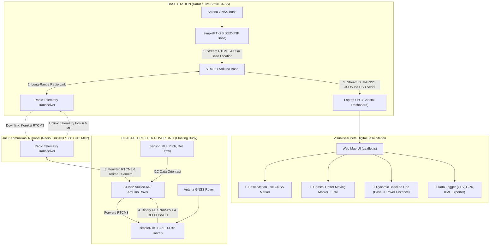

# Coastal Driffter - STM32 & Dual-Arduino RTK GNSS + IMU Telemetry System

Dokumentasi utama untuk proyek **Coastal Driffter**: Sistem drifter pantai/laut lepas berbasis mikrokontroler **STM32 Nucleo-64** & **Arduino**, sensor orientasi **IMU (Inertial Measurement Unit)**, modul **simpleRTK2B (u-blox ZED-F9P) Dual-RTK GNSS**, serta **Web Map Dashboard Real-Time** dengan pemetaan lokasi live **Base Station** dan **Rover**.

---

## 📑 Daftar Isi
1. [Gambaran Umum & Arsitektur Dual-GNSS](#1-gambaran-umum--arsitektur-dual-gnss)
2. [Spesifikasi Hardware & Pinout Wiring](#2-spesifikasi-hardware--pinout-wiring)
3. [Sensor IMU & Pengolahan Data Telemetri](#3-sensor-imu--pengolahan-data-telemetri)
4. [Tingkat Akurasi & Mode Operasi RTK GNSS](#4-tingkat-akurasi--mode-operasi-rtk-gnss)
5. [Firmware STM32 & Arduino Rover/Base](#5-firmware-stm32--arduino-roverbase)
6. [Visualisasi Peta & Data Logger Dual-GNSS](#6-visualisasi-peta--data-logger-dual-gnss)
7. [Panduan Uji Jangkauan Radio (Field Range Test)](#7-panduan-uji-jangkauan-radio-field-range-test)

---

## 1. Gambaran Umum & Arsitektur Dual-GNSS

**Coastal Driffter** dirancang untuk melacak pergerakan arus air laut/pantai, dinamika gelombang, dan posisi permukaan air secara presisi hingga tingkat sentimeter ($1 - 2\text{ cm}$).



---

## 2. Spesifikasi Hardware & Pinout Wiring

### A. Komponen Utama
* **Microcontroller Core**: STM32 Nucleo-64 (STM32L152 / STM32F4) atau Arduino Mega 2560 / ESP32.
* **GNSS Engine**: Dual simpleRTK2B Board (u-blox ZED-F9P multi-band RTK).
* **Motion Sensor**: IMU (MPU6050 / MPU9250 / BNO055 6-DOF/9-DOF).
* **Wireless Transceiver**: Radio Telemetry (Telemetry 433MHz / 915MHz / LoRa Transceiver).

---

## 3. Sensor IMU & Pengolahan Data Telemetri

### Output Format Dual-GNSS JSON di Base Station (ke Laptop Dashboard)
`Arduino_Base.ino` mem-parse lokasi GNSS Base dan menggabungkannya dengan paket telemetri Rover menjadi format JSON berikut:

```json
{
  "base": {
    "lat": -6.1753924,
    "lon": 106.8271532,
    "alt": 15.420
  },
  "rover": {
    "id": 1,
    "lat": -6.1754100,
    "lon": 106.8272100,
    "alt": 15.500,
    "fix": 4,
    "hAcc_cm": 1.2,
    "speed_kmh": 14.5,
    "heading": 128.4,
    "pitch": 1.5,
    "roll": -0.8,
    "relN_m": 42.15,
    "relE_m": 18.70
  }
}
```

---

## 4. Tingkat Akurasi & Mode Operasi RTK GNSS

| Mode Operasi | Kode `fix` | Akurasi Horizontal | Akurasi Vertikal | Karakteristik & Kondisi Sinyal |
|---|---|---|---|---|
| **RTK FIX** | `4` | **$1.0\text{ cm} + 1\text{ ppm}$** ($\approx 1.1\text{ cm}$) | **$1.5\text{ cm} + 1\text{ ppm}$** | **Presisi Tinggi (Centimeter)**. Ambiguity integer terkunci sempurna, sinyal radio RTCM3 lancar. |
| **RTK FLOAT** | `5` | **$10\text{ cm} - 50\text{ cm}$** | **$20\text{ cm} - 80\text{ cm}$** | **Presisi Menengah**. Koreksi RTCM3 diterima, tetapi terdapat multipath atau pembiasan gelombang laut. |
| **Autonomous / 3D Fix** | `1` / `3` | **$1.5\text{ m} - 2.5\text{ m}$** | **$2.5\text{ m} - 5.0\text{ m}$** | **Standar Single GPS**. Koneksi radio terputus atau Base Station belum siap. |

---

## 5. Firmware STM32 & Arduino Rover/Base

Firmware tersedia pada direktori repositori:
- **`Arduino_Rover/Arduino_Rover.ino`**: Mengimplementasikan **Native UBX Binary Parser** (`UBX-NAV-PVT` & `UBX-NAV-RELPOSNED`), pengolahan data IMU, dan pengiriman paket telemetri 5 Hz.
- **`Arduino_Base/Arduino_Base.ino`**: Mengurai lokasi live GNSS Base, mengirimkan stream koreksi RTCM3 ke drifter, dan menerjemahkan paket telemetri menjadi **Dual-GNSS JSON Stream** ke laptop via USB Serial.
- **`Refrensi/STM32 Nucleo 64/`**: Kode referensi C/C++ berbasis STM32 HAL library (`gnss.c`, `hardware.c`, `tasks.c`).

---

## 6. Visualisasi Peta & Data Logger Dual-GNSS

File `map_dashboard.html` menyediakan antarmuka pemantauan interaktif berbasis **Leaflet.js** dan **Web Serial API**:

### Fitur Web Dashboard:
- 📌 **Base Station Auto-Plot**: Menampilkan titik koordinat posisi aktual **Base Station**.
- 🚤 **Rover Real-Time Tracking**: Penanda pergerakan drifter bergerak secara animasi lengkap dengan garis lintasan (*trail line*).
- 📏 **Baseline Line & Distance**: Garis penghubung putus-putus antara titik Base Station dan Rover beserta indikator jarak lurus (*Baseline Distance*).
- 📊 **Telemetry Live Stats**: Indikator status RTK FIX, Koordinat presisi, Akurasi Horizontal ($hAcc$), Kecepatan, Heading, serta Orientasi IMU (Pitch/Roll).
- 💾 **Multi-Format Data Logger**: Ekspor riwayat koordinat ke file format **.CSV**, **.GPX**, dan **.KML**.

---

## 7. Panduan Uji Jangkauan Radio (Field Range Test)

1. **Persiapan Base Station**: Pasang antena Base GNSS dan Radio Telemetry di lokasi darat yang tinggi (*Clear Sky View*).
2. **Deployment Drifter**: Nyalakan buoy Coastal Drifter hingga indikator RTK FIX menyala.
3. **Monitoring & Logging**: Buka `map_dashboard.html` di Google Chrome / Edge, klik **🔌 Hubungkan ke Base Serial (USB)**, dan pantau pergerakan drifter serta jarak baseline Base-Rover.
4. **Analisis Data**: Klik **📥 Ekspor CSV / GPX / KML** untuk mengunduh log koordinat.

---

*Coastal Driffter Dual-GNSS System Documentation (2026).*
