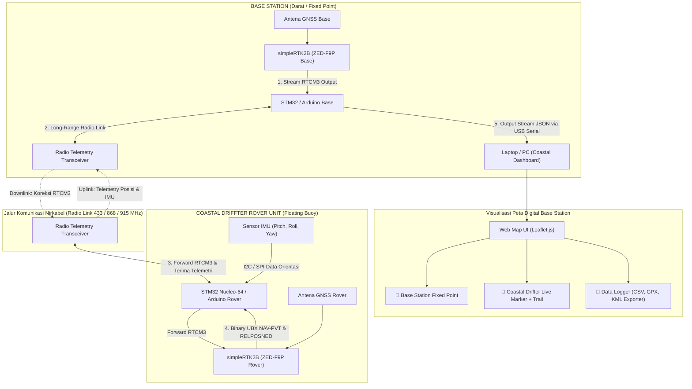

# Coastal Driffter - STM32 & Dual-Arduino RTK GNSS + IMU Telemetry System

Dokumentasi utama untuk proyek **Coastal Driffter**: Sistem drifter pantai/laut lepas berbasis mikrokontroler **STM32 Nucleo-64** & **Arduino**, sensor orientasi **IMU (Inertial Measurement Unit)**, modul **simpleRTK2B (u-blox ZED-F9P) Dual-RTK GNSS**, serta **Web Map Dashboard Real-Time** dengan fitur perekaman dan ekspor data telemetri.

---

## 📑 Daftar Isi
1. [Gambaran Umum & Arsitektur Sistem](#1-gambaran-umum--arsitektur-sistem)
2. [Spesifikasi Hardware & Pinout Wiring](#2-spesifikasi-hardware--pinout-wiring)
3. [Sensor IMU & Pengolahan Data Telemetri](#3-sensor-imu--pengolahan-data-telemetri)
4. [Tingkat Akurasi & Mode Operasi RTK GNSS](#4-tingkat-akurasi--mode-operasi-rtk-gnss)
5. [Firmware STM32 & Arduino Rover/Base](#5-firmware-stm32--arduino-roverbase)
6. [Visualisasi Peta & Data Logger (Web Dashboard)](#6-visualisasi-peta--data-logger-web-dashboard)
7. [Panduan Uji Jangkauan Radio (Field Range Test)](#7-panduan-uji-jangkauan-radio-field-range-test)

---

## 1. Gambaran Umum & Arsitektur Sistem

**Coastal Driffter** dirancang untuk melacak pergerakan arus air laut/pantai, dinamika gelombang, dan posisi permukaan air secara presisi hingga tingkat sentimeter ($1 - 2\text{ cm}$).

### Alur Kerja Utama:
1. **Base Station (Fixed Base)**: Modul `simpleRTK2B Base` menerima sinyal satelit GNSS dan menghasilkan pesan koreksi **RTCM3**, yang dikirimkan oleh Base Controller via Radio Telemetry ke Drifter.
2. **Coastal Drifter Unit (Rover)**:
   - Menerima koreksi RTCM3 dan mengumpankannya ke `simpleRTK2B Rover (ZED-F9P)` untuk menghitung koordinat RTK FIX presisi tinggi.
   - Membaca dinamika siklus gelombang laut dan kemiringan buoy menggunakan **Sensor IMU** (Pitch, Roll, Heading).
   - Mengurai paket binary **UBX-NAV-PVT** dan **UBX-NAV-RELPOSNED** secara native pada MCU.
   - Mengemas koordinat presisi dan orientasi IMU, lalu memancarkannya kembali ke Base Station.
3. **Web Dashboard & Logger**: Laptop Base Station menerima stream JSON via USB Serial, menampilkan gerakan drifter secara real-time pada peta digital, serta menyediakan fitur pencatatan dan ekspor data dalam format **.CSV**, **.GPX**, dan **.KML**.

---

## 2. Spesifikasi Hardware & Pinout Wiring

### A. Komponen Utama
* **Microcontroller Core**: STM32 Nucleo-64 (STM32L152 / STM32F4) atau Arduino Mega 2560 / ESP32.
* **GNSS Engine**: Dual simpleRTK2B Board (u-blox ZED-F9P multi-band RTK).
* **Motion Sensor**: IMU (MPU6050 / MPU9250 / BNO055 6-DOF/9-DOF).
* **Wireless Transceiver**: Radio Telemetry (Telemetry 433MHz / 915MHz / LoRa Transceiver).

### B. Tabel Koneksi (Rover / Coastal Drifter Unit)
| Komponen 1 | Pin Komponen 1 | Komponen 2 | Pin Komponen 2 | Keterangan |
|---|---|---|---|---|
| **simpleRTK2B Rover** | `TX1` | **STM32 / Arduino** | `RX1` (USART1_RX) | Data UBX Binary dari ZED-F9P |
| **simpleRTK2B Rover** | `RX1` | **STM32 / Arduino** | `TX1` (USART1_TX) | Umpan RTCM3 ke ZED-F9P |
| **Radio Telemetry** | `TX` | **STM32 / Arduino** | `RX2` (USART2_RX) | Terima RTCM3 dari Base |
| **Radio Telemetry** | `RX` | **STM32 / Arduino** | `TX2` (USART2_TX) | Kirim Telemetri ke Base |
| **Sensor IMU** | `SDA / SCL` | **STM32 / Arduino** | `I2C_SDA / I2C_SCL` | Data Orientasi Buoy (Pitch/Roll) |
| **Catu Daya** | `5V / GND` | **Baterai LiPo / Solar** | `5V / GND` | Daya sistem buoy |

---

## 3. Sensor IMU & Pengolahan Data Telemetri

Sensor IMU pada buoy Coastal Drifter berfungsi untuk mengukur siklus gelombang laut (*wave attitude dynamics*) serta arah hadap buoy (*heading/yaw*).

### Struktur Paket Telemetri Terkompresi (32 Bytes Binary Payload)
| Parameter | Tipe Data | Satuan / Format | Keterangan |
|---|---|---|---|
| `header` | `uint16_t` | `0xAABB` | Frame Sync Header |
| `rover_id` | `uint8_t` | ID | ID Unik Drifter (misal: `1`) |
| `latitude` | `int32_t` | Deg $\times 10^7$ | Lintang presisi tinggi |
| `longitude` | `int32_t` | Deg $\times 10^7$ | Bujur presisi tinggi |
| `altitude_mm` | `int32_t` | mm | Ketinggian permukaan laut (MSL / Ellipsoid) |
| `fix_status` | `uint8_t` | Code | `4` = **RTK FIX**, `5` = **RTK FLOAT**, `1` = Single |
| `h_acc_mm` | `uint16_t` | mm | Estimasi akurasi horizontal |
| `speed_01kmh` | `uint16_t` | $0.1\text{ km/h}$ | Kecepatan hanyut drifter |
| `heading_01deg` | `uint16_t` | $0.1^\circ$ | Arah gerakan drifter |
| `pitch_01deg` | `int16_t` | $0.1^\circ$ | Sudut kemiringan depan-belakang IMU |
| `roll_01deg` | `int16_t` | $0.1^\circ$ | Sudut kemiringan samping IMU |
| `rel_pos_N` | `int16_t` | cm | Vektor posisi relatif Utara dari Base |
| `rel_pos_E` | `int16_t` | cm | Vektor posisi relatif Timur dari Base |
| `checksum` | `uint8_t` | XOR CRC | Validasi integritas data |

---

## 4. Tingkat Akurasi & Mode Operasi RTK GNSS

| Mode Operasi | Kode `fix` | Akurasi Horizontal | Akurasi Vertikal | Karakteristik & Kondisi Sinyal |
|---|---|---|---|---|
| **RTK FIX** | `4` | **$1.0\text{ cm} + 1\text{ ppm}$** ($\approx 1.1\text{ cm}$) | **$1.5\text{ cm} + 1\text{ ppm}$** | **Presisi Tinggi (Centimeter)**. Ambiguity integer terkunci sempurna, sinyal radio RTCM3 lancar. |
| **RTK FLOAT** | `5` | **$10\text{ cm} - 50\text{ cm}$** | **$20\text{ cm} - 80\text{ cm}$** | **Presisi Menengah**. Koreksi RTCM3 diterima, tetapi terdapat multipath atau pembiasan gelombang laut. |
| **Autonomous / 3D Fix** | `1` / `3` | **$1.5\text{ m} - 2.5\text{ m}$** | **$2.5\text{ m} - 5.0\text{ m}$** | **Standar Single GPS**. Koneksi radio terputus atau Base Station belum siap. |

---

## 5. Firmware STM32 & Arduino Rover/Base

Firmware tersedia pada direktori repositori:
- **`Arduino_Rover/Arduino_Rover.ino`**: Mengimplementasikan **Native UBX Binary Parser** (`UBX-NAV-PVT` & `UBX-NAV-RELPOSNED`), pengolahan data IMU, dan pengiriman paket telemetri 5 Hz.
- **`Arduino_Base/Arduino_Base.ino`**: Mengirimkan stream koreksi RTCM3 ke drifter dan menerjemahkan paket telemetri menjadi **JSON Stream** ke laptop via USB Serial.
- **`Refrensi/STM32 Nucleo 64/`**: Kode referensi C/C++ berbasis STM32 HAL library (`gnss.c`, `hardware.c`, `tasks.c`).

---

## 6. Visualisasi Peta & Data Logger (Web Dashboard)

File `map_dashboard.html` menyediakan antarmuka pemantauan interaktif berbasis **Leaflet.js** dan **Web Serial API**:

### Fitur Web Dashboard:
- 🗺️ **Real-Time Tracking**: Penanda posisi Base Station dan posisi Coastal Drifter yang bergerak secara animasi lengkap dengan garis lintasan (*trail line*).
- 📊 **Telemetry Live Stats**: Indikator status RTK FIX, Koordinat presisi (7 desimal), Akurasi Horizontal ($hAcc$), Kecepatan, Heading, serta Orientasi IMU (Pitch/Roll).
- 💾 **Multi-Format Data Logger**:
  - **Mulai / Stop Perekaman**: Mencatat koordinat dan timestamp secara real-time.
  - **Ekspor CSV**: Menyimpan log mentah untuk analisis statistik di Excel / MATLAB.
  - **Ekspor GPX**: Format standar GPS Exchange untuk QGIS, Google Earth, dan aplikasi GIS.
  - **Ekspor KML**: Format Google Earth dengan visualisasi jalur lintasan berwarna sesuai status RTK.

---

## 7. Panduan Uji Jangkauan Radio (Field Range Test)

### Langkah-langkah Pengujian di Lapangan:
1. **Persiapan Base Station**:
   - Tempatkan antena Base GNSS di lokasi darat yang tinggi dengan pandangan langit terbuka (*Clear Sky View*).
   - Pasang antena Radio Telemetry secara vertikal.
2. **Deployment Coastal Drifter**:
   - Nyalakan sistem buoy Coastal Drifter dan pastikan LED indikator RTK FIX pada board `simpleRTK2B Rover` menyala (hijau).
   - Lepaskan drifter ke perairan pantai / laut.
3. **Monitoring & Logging**:
   - Buka `map_dashboard.html` di Google Chrome / Edge.
   - Klik **🔌 Hubungkan ke Base Serial (USB)** dan aktifkan **🔴 Mulai Record**.
   - Pantau jarak jangkauan radio (*Line-of-Sight*), tingkat kekerapan pembaharuan data (Hz), serta kestabilan status RTK FIX.
4. **Analisis Data Pasca-Uji**:
   - Klik **📥 Ekspor CSV / GPX / KML** untuk mengunduh riwayat jejak lintasan drifter dan menganalisis arus air pantai.

---

*Coastal Drifter System Documentation (2026).*
