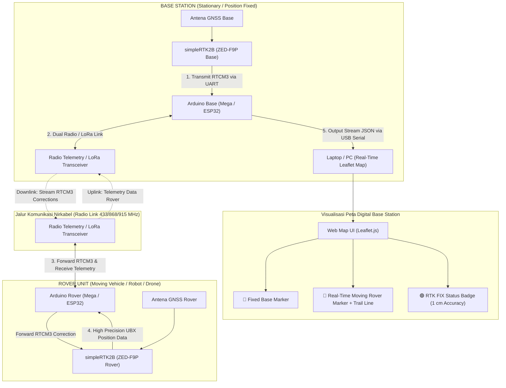

# Dual-Arduino RTK System - Moving Rover & Stationary Base with Real-Time Map Dashboard

Dokumen ini memuat panduan lengkap perancangan, arsitektur, kode program, dan visualisasi untuk **Sistem RTK GNSS berbasis Dual-Arduino**. Dalam sistem ini, **Base Station berada pada posisi diam (fixed)** dan **Rover berada pada posisi bergerak (moving vehicle/robot)**. Data telemetri posisi presisi tinggi dari Rover dikirimkan secara nirkabel kembali ke Base Station untuk diproses dan ditampilkan secara *real-time* pada peta digital interaktif.

---

## 📑 Daftar Isi
1. [Arsitektur & Konsep Komunikasi Dua Arah](#1-arsitektur--konsep-komunikasi-dua-arah)
2. [Pinout & Wiring Diagram](#2-pinout--wiring-diagram)
3. [Spesifikasi Data Telemetri & Pengolahan](#3-spesifikasi-data-telemetri--pengolahan)
4. [Tingkat Akurasi & Mode Operasi RTK](#4-tingkat-akurasi--mode-operasi-rtk)
5. [Kode Program Arduino Rover & Arduino Base](#5-kode-program-arduino-rover--arduino-base)
6. [Visualisasi Peta Real-Time (Web Dashboard)](#6-visualisasi-peta-real-time-web-dashboard)
7. [Panduan Pengujian & Deployment](#7-panduan-pengujian--deployment)

---

## 1. Arsitektur & Konsep Komunikasi Dua Arah

Sistem ini mengimplementasikan **Komunikasi Dua Arah (Bi-Directional Wireless Link)** antara Base Station dan Rover menggunakan modul Radio Telemetry / LoRa / XBee:



### Alur Kerja Sistem:
1. **Penerbitan Koreksi (Base Station)**: Modul `simpleRTK2B Base` yang diam menangkap sinyal satelit dan menghasilkan pesan koreksi **RTCM3**. Data ini dikirim ke **Arduino Base** via UART.
2. **Kirim Koreksi (Downlink)**: Arduino Base memancarkan paket RTCM3 melalui **Radio Telemetry** ke Rover.
3. **Penerimaan Koreksi & Perhitungan RTK (Rover)**: Arduino Rover menerima data RTCM3 dari radio dan mengumpankannya ke `simpleRTK2B Rover`. Chip ZED-F9P pada Rover mengkalkulasi koordinat presisi tinggi hingga tingkat **centimeter (RTK FIX)**.
4. **Kirim Telemetri (Uplink)**: Arduino Rover membaca data posisi (Lat, Lon, Alt, Fix Status, Speed, Heading, RelPos) dari ZED-F9P, mengemasnya menjadi paket telemetri, dan memancarkannya kembali ke Base Station via Radio Telemetry.
5. **Visualisasi Peta (Base Dashboard)**: Arduino Base menerima paket telemetri Rover, mengubahnya menjadi format **JSON**, dan mengirimkannya melalui USB Serial ke PC/Laptop untuk menampilkan animasi pergerakan Rover pada **Peta Interaktif Web**.

---

## 2. Pinout & Wiring Diagram

Rekomendasi microcontroller yang digunakan adalah **Arduino Mega 2560** atau **ESP32** karena memiliki lebih dari 1 Hardware Serial Port (UART).

### A. Connection Table - ROVER UNIT
| Component 1 | Pin Component 1 | Component 2 | Pin Component 2 | Notes |
|---|---|---|---|---|
| **simpleRTK2B Rover** | `TX1` | **Arduino Mega / ESP32** | `RX1` (Pin 19 / GPIO 16) | Terima data UBX dari ZED-F9P |
| **simpleRTK2B Rover** | `RX1` | **Arduino Mega / ESP32** | `TX1` (Pin 18 / GPIO 17) | Kirim RTCM3 ke ZED-F9P |
| **Radio Telemetry / XBee** | `TX` | **Arduino Mega / ESP32** | `RX2` (Pin 17 / GPIO 4) | Terima RTCM3 & perintah dari Radio |
| **Radio Telemetry / XBee** | `RX` | **Arduino Mega / ESP32** | `TX2` (Pin 16 / GPIO 2) | Kirim paket Telemetri ke Base |
| **Power 5V / GND** | `5V / GND` | **Arduino / Power Bank** | `5V / GND` | Catu daya Rover |

### B. Connection Table - BASE STATION UNIT
| Component 1 | Pin Component 1 | Component 2 | Pin Component 2 | Notes |
|---|---|---|---|---|
| **simpleRTK2B Base** | `TX1` | **Arduino Mega / ESP32** | `RX1` (Pin 19 / GPIO 16) | Terima stream RTCM3 dari Base ZED-F9P |
| **Radio Telemetry / XBee** | `TX` | **Arduino Mega / ESP32** | `RX2` (Pin 17 / GPIO 4) | Terima Telemetri dari Rover |
| **Radio Telemetry / XBee** | `RX` | **Arduino Mega / ESP32** | `TX2` (Pin 16 / GPIO 2) | Kirim RTCM3 ke Rover |
| **Arduino USB Port** | `USB Port` | **Laptop / PC** | `USB Port` | Power & Serial Data JSON to Web Map |

---

## 3. Spesifikasi Data Telemetri & Pengolahan

Rover mengemas data posisi dan kualitas navigasi dari ZED-F9P menjadi struktur paket telemetri terkompresi.

### A. Struktur Data Telemetri (Binary Payload / JSON)
| Parameter | Tipe Data | Satuan / Format | Keterangan & Fungsi |
|---|---|---|---|
| `rover_id` | `uint8_t` | ID | Identitas unik Rover (misal: `1`) |
| `latitude` | `int32_t` | Derajat ($10^{-7}$) | Lintang presisi tinggi (derajat = `latitude / 1e7`) |
| `longitude` | `int32_t` | Derajat ($10^{-7}$) | Bujur presisi tinggi (derajat = `longitude / 1e7`) |
| `altitude` | `int32_t` | mm | Ketinggian di atas ellipsoid WGS84 (meter = `altitude / 1000.0`) |
| `fix_status` | `uint8_t` | Code | `4` = **RTK FIX**, `5` = **RTK FLOAT**, `1` = 3D Fix (Single) |
| `h_acc` | `uint16_t` | mm | Estimasi akurasi horizontal real-time |
| `speed_kmh` | `uint16_t` | $0.1\text{ km/h}$ | Kecepatan bergerak Rover |
| `heading` | `uint16_t` | $0.1^\circ$ | Arah hadap Rover ($0^\circ - 360^\circ$) |
| `rel_pos_N` | `int16_t` | cm | Vektor posisi relatif Utara dari Base Station |
| `rel_pos_E` | `int16_t` | cm | Vektor posisi relatif Timur dari Base Station |

### B. Output Format JSON di Base Station (ke Dashboard Laptop)
Arduino Base mendekode paket nirkabel dari Rover dan mengirimkan JSON string berikut via USB Serial (Baudrate 115200 bps):

```json
{
  "id": 1,
  "lat": -6.1753924,
  "lon": 106.8271532,
  "alt": 15.420,
  "fix": 4,
  "fix_str": "RTK FIX",
  "hAcc_cm": 1.2,
  "speed_kmh": 14.5,
  "heading": 128.4,
  "relN_m": 42.15,
  "relE_m": 18.70,
  "ts": 1245300
}
```

---

## 4. Tingkat Akurasi & Mode Operasi RTK

Tingkat akurasi posisi Rover yang ditampilkan pada peta bergantung pada kualitas koreksi RTCM3 dan status sinyal GPS:

| Mode Operasi | Kode `fix` | Akurasi Horizontal | Akurasi Vertikal | Kondisi Penyebab & Karakteristik |
|---|---|---|---|---|
| **RTK FIX** | `4` | **$1.0\text{ cm} + 1\text{ ppm}$** ($\approx 1.1\text{ cm}$) | **$1.5\text{ cm} + 1\text{ ppm}$** | **Kondisi Terbaik (Presisi Centimeter)**. Sinyal satelit bersih, koreksi RTCM3 lancar, dan *carrier phase integer ambiguity* berhasil di-lock. |
| **RTK FLOAT** | `5` | **$10\text{ cm} - 50\text{ cm}$** | **$20\text{ cm} - 80\text{ cm}$** | **Kondisi Sedang**. Koreksi RTCM3 diterima, tetapi ada beberapa satelit terhalang pohon/gedung sehingga ambiguity belum lock sempurna. |
| **Autonomous / 3D Fix** | `1` / `3` | **$1.5\text{ m} - 2.5\text{ m}$** | **$2.5\text{ m} - 5.0\text{ m}$** | **Kondisi Standar**. Sinyal koreksi radio terputus atau Base Station mati. Rover berfungsi seperti GPS biasa. |

---

## 5. Kode Program Arduino Rover & Arduino Base

### A. Program ROVER (`Arduino_Rover.ino`)

Upload kode berikut ke **Arduino Rover** (misal Arduino Mega 2560):

```cpp
#include <Arduino.h>

// Definisi Serial Port
// Serial1: Terhubung ke simpleRTK2B Rover (RX1=19, TX1=18)
// Serial2: Terhubung ke Radio Telemetry Transceiver (RX2=17, TX2=16)

#define RTK_SERIAL Serial1
#define RADIO_SERIAL Serial2

#pragma pack(push, 1)
struct TelemetryPacket {
  uint8_t  header1 = 0xAA;
  uint8_t  header2 = 0xBB;
  uint8_t  rover_id = 1;
  int32_t  lat;        // Deg * 1e7
  int32_t  lon;        // Deg * 1e7
  int32_t  alt_mm;     // mm
  uint8_t  fix_status; // 4=RTK FIX, 5=RTK FLOAT, 1=Single
  uint16_t h_acc_mm;   // mm
  uint16_t speed_01kmh;// 0.1 km/h
  uint16_t heading_01deg; // 0.1 deg
  int16_t  rel_N_cm;   // cm
  int16_t  rel_E_cm;   // cm
  uint8_t  checksum;
};
#pragma pack(pop)

TelemetryPacket telePacket;
unsigned long lastSendTime = 0;

uint8_t calculateChecksum(uint8_t *data, size_t len) {
  uint8_t crc = 0;
  for (size_t i = 0; i < len; i++) crc ^= data[i];
  return crc;
}

void setup() {
  Serial.begin(115200);      // Debug Serial
  RTK_SERIAL.begin(38400);   // Baudrate ZED-F9P
  RADIO_SERIAL.begin(57600); // Baudrate Radio Telemetry

  Serial.println(F("[ROVER] System Initialized. Waiting for RTCM3 & UBX Data..."));
}

void loop() {
  // 1. Forward RTCM3 dari Radio Telemetry ke simpleRTK2B Rover
  while (RADIO_SERIAL.available()) {
    uint8_t b = RADIO_SERIAL.read();
    RTK_SERIAL.write(b); // Feed RTCM3 correction to ZED-F9P
  }

  // 2. Simulasi/Read Data dari simpleRTK2B Rover (UBX Parser Ringkas)
  // Catatan: Pada implementasi nyata, parsing UBX-NAV-PVT dan RELPOSNED diproses di sini.
  if (millis() - lastSendTime >= 200) { // Send Telemetry 5 Hz (setiap 200ms)
    lastSendTime = millis();

    // Isi contoh data ter-parse dari ZED-F9P
    telePacket.lat = -61753924;      // -6.1753924 Deg
    telePacket.lon = 1068271532;     // 106.8271532 Deg
    telePacket.alt_mm = 15420;       // 15.42 m
    telePacket.fix_status = 4;       // 4 = RTK FIX
    telePacket.h_acc_mm = 12;        // 12 mm = 1.2 cm
    telePacket.speed_01kmh = 145;    // 14.5 km/h
    telePacket.heading_01deg = 1284; // 128.4 deg
    telePacket.rel_N_cm = 4215;      // 42.15 m
    telePacket.rel_E_cm = 1870;      // 18.70 m

    // Hitung Checksum
    telePacket.checksum = calculateChecksum((uint8_t*)&telePacket, sizeof(TelemetryPacket) - 1);

    // Kirim paket telemetri via Radio Telemetry ke Base
    RADIO_SERIAL.write((uint8_t*)&telePacket, sizeof(TelemetryPacket));
  }
}
```

---

### B. Program BASE STATION (`Arduino_Base.ino`)

Upload kode berikut ke **Arduino Base** (misal Arduino Mega 2560):

```cpp
#include <Arduino.h>

#define RTK_BASE_SERIAL Serial1 // Dari simpleRTK2B Base (RTCM3 Output)
#define RADIO_SERIAL    Serial2 // Radio Telemetry ke/dari Rover
#define PC_SERIAL       Serial  // USB Serial ke Laptop/PC Dashboard

#pragma pack(push, 1)
struct TelemetryPacket {
  uint8_t  header1;
  uint8_t  header2;
  uint8_t  rover_id;
  int32_t  lat;
  int32_t  lon;
  int32_t  alt_mm;
  uint8_t  fix_status;
  uint16_t h_acc_mm;
  uint16_t speed_01kmh;
  uint16_t heading_01deg;
  int16_t  rel_N_cm;
  int16_t  rel_E_cm;
  uint8_t  checksum;
};
#pragma pack(pop)

TelemetryPacket inPacket;
uint8_t rxBuffer[sizeof(TelemetryPacket)];
size_t rxIndex = 0;

uint8_t calculateChecksum(uint8_t *data, size_t len) {
  uint8_t crc = 0;
  for (size_t i = 0; i < len; i++) crc ^= data[i];
  return crc;
}

void processRoverPacket(const TelemetryPacket& pkt) {
  // Format data menjadi JSON String dan kirim ke PC Laptop
  PC_SERIAL.print(F("{\"id\":"));
  PC_SERIAL.print(pkt.rover_id);
  PC_SERIAL.print(F(",\"lat\":"));
  PC_SERIAL.print(pkt.lat / 1e7, 7);
  PC_SERIAL.print(F(",\"lon\":"));
  PC_SERIAL.print(pkt.lon / 1e7, 7);
  PC_SERIAL.print(F(",\"alt\":"));
  PC_SERIAL.print(pkt.alt_mm / 1000.0, 3);
  PC_SERIAL.print(F(",\"fix\":"));
  PC_SERIAL.print(pkt.fix_status);
  PC_SERIAL.print(F(",\"hAcc_cm\":"));
  PC_SERIAL.print(pkt.h_acc_mm / 10.0, 1);
  PC_SERIAL.print(F(",\"speed_kmh\":"));
  PC_SERIAL.print(pkt.speed_01kmh / 10.0, 1);
  PC_SERIAL.print(F(",\"heading\":"));
  PC_SERIAL.print(pkt.heading_01deg / 10.0, 1);
  PC_SERIAL.print(F(",\"relN_m\":"));
  PC_SERIAL.print(pkt.rel_N_cm / 100.0, 2);
  PC_SERIAL.print(F(",\"relE_m\":"));
  PC_SERIAL.print(pkt.rel_E_cm / 100.0, 2);
  PC_SERIAL.println(F("}"));
}

void setup() {
  PC_SERIAL.begin(115200);       // USB Serial to Laptop Dashboard
  RTK_BASE_SERIAL.begin(38400);  // Baudrate Base ZED-F9P
  RADIO_SERIAL.begin(57600);    // Baudrate Radio Telemetry
}

void loop() {
  // 1. Forward data koreksi RTCM3 dari Base ZED-F9P ke Radio Telemetry (Downlink ke Rover)
  while (RTK_BASE_SERIAL.available()) {
    uint8_t b = RTK_BASE_SERIAL.read();
    RADIO_SERIAL.write(b);
  }

  // 2. Terima data Telemetri dari Rover via Radio Telemetry (Uplink dari Rover)
  while (RADIO_SERIAL.available()) {
    uint8_t b = RADIO_SERIAL.read();

    if (rxIndex == 0 && b != 0xAA) continue;
    if (rxIndex == 1 && b != 0xBB) { rxIndex = 0; continue; }

    rxBuffer[rxIndex++] = b;

    if (rxIndex >= sizeof(TelemetryPacket)) {
      memcpy(&inPacket, rxBuffer, sizeof(TelemetryPacket));
      uint8_t calcCrc = calculateChecksum(rxBuffer, sizeof(TelemetryPacket) - 1);

      if (calcCrc == inPacket.checksum) {
        processRoverPacket(inPacket); // Valid Packet! Stream JSON to PC
      }
      rxIndex = 0;
    }
  }
}
```

---

## 6. Visualisasi Peta Real-Time (Web Dashboard)

Simpan kode HTML/JavaScript berikut sebagai file `map_dashboard.html`. File ini menggunakan library **Leaflet.js** dan **Web Serial API** browser untuk membaca data JSON langsung dari port USB Arduino Base dan menampilkannya di peta secara interaktif.

```html
<!DOCTYPE html>
<html lang="id">
<head>
  <meta charset="UTF-8">
  <title>RTK Dual-Arduino Real-Time Rover Tracker</title>
  <link rel="stylesheet" href="https://unpkg.com/leaflet@1.9.4/dist/leaflet.css" />
  <script src="https://unpkg.com/leaflet@1.9.4/dist/leaflet.js"></script>
  <style>
    body { margin: 0; font-family: 'Segoe UI', Arial, sans-serif; }
    #map { height: 100vh; width: 100vw; }
    #panel {
      position: absolute; top: 15px; right: 15px; z-index: 1000;
      background: rgba(255, 255, 255, 0.95); padding: 20px; border-radius: 12px;
      box-shadow: 0 4px 20px rgba(0,0,0,0.15); width: 300px;
    }
    .badge { padding: 4px 10px; border-radius: 6px; font-weight: bold; color: white; display: inline-block; }
    .rtk-fix { background-color: #2ecc71; }
    .rtk-float { background-color: #f39c12; }
    .rtk-single { background-color: #e74c3c; }
    button {
      width: 100%; padding: 10px; background: #3498db; color: white;
      border: none; border-radius: 6px; font-size: 14px; cursor: pointer; margin-bottom: 12px;
    }
    button:hover { background: #2980b9; }
    .stat-row { display: flex; justify-content: space-between; margin: 6px 0; font-size: 14px; }
  </style>
</head>
<body>

  <div id="panel">
    <h3>🚗 RTK Rover Telemetry</h3>
    <button id="btnConnect">Hubungkan ke Arduino Base (Serial)</button>
    
    <div class="stat-row">
      <span>Status RTK:</span>
      <span id="txtFix" class="badge rtk-single">DISCONNECTED</span>
    </div>
    <div class="stat-row"><span>Latitude:</span><b id="txtLat">-</b></div>
    <div class="stat-row"><span>Longitude:</span><b id="txtLon">-</b></div>
    <div class="stat-row"><span>Altitude:</span><b id="txtAlt">-</b></div>
    <div class="stat-row"><span>Akurasi (hAcc):</span><b id="txtAcc">-</b></div>
    <div class="stat-row"><span>Kecepatan:</span><b id="txtSpeed">-</b></div>
    <div class="stat-row"><span>Heading:</span><b id="txtHeading">-</b></div>
  </div>

  <div id="map"></div>

  <script>
    // Inisialisasi Peta Leaflet
    const basePos = [-6.17539, 106.82715];
    const map = L.map('map').setView(basePos, 18);

    L.tileLayer('https://{s}.tile.openstreetmap.org/{z}/{x}/{y}.png', {
      maxZoom: 21,
      attribution: '© OpenStreetMap contributors | RTK Navigation'
    }).addTo(map);

    // Marker Base Station (Fixed)
    const baseMarker = L.marker(basePos).addTo(map).bindPopup('<b>📌 Base Station (Fixed)</b>').openPopup();

    // Marker Rover (Moving) & Line Path Trail
    let roverMarker = L.marker(basePos).addTo(map).bindPopup('<b>🚗 Rover Vehicle</b>');
    let pathPolyline = L.polyline([], { color: '#e74c3c', weight: 4 }).addTo(map);

    // Handler Serial Port Browser (Web Serial API)
    document.getElementById('btnConnect').addEventListener('click', async () => {
      try {
        const port = await navigator.serial.requestPort();
        await port.open({ baudRate: 115200 });

        const decoder = new TextDecoderStream();
        port.readable.pipeTo(decoder.writable);
        const reader = decoder.readable.getReader();

        let buffer = '';
        while (true) {
          const { value, done } = await reader.read();
          if (done) break;
          buffer += value;
          let lines = buffer.split('\n');
          buffer = lines.pop(); // Keep partial line

          for (let line of lines) {
            line = line.trim();
            if (line.startsWith('{') && line.endsWith('}')) {
              try {
                const data = JSON.parse(line);
                updateDashboard(data);
              } catch (e) {}
            }
          }
        }
      } catch (err) {
        alert('Gagal menghubungkan ke Serial: ' + err);
      }
    });

    function updateDashboard(data) {
      const lat = data.lat;
      const lon = data.lon;
      const newPos = [lat, lon];

      // Update Marker Rover & Path Line
      roverMarker.setLatLng(newPos);
      pathPolyline.addLatLng(newPos);
      map.panTo(newPos);

      // Update Info Panel
      document.getElementById('txtLat').innerText = lat.toFixed(7);
      document.getElementById('txtLon').innerText = lon.toFixed(7);
      document.getElementById('txtAlt').innerText = data.alt + ' m';
      document.getElementById('txtAcc').innerText = data.hAcc_cm + ' cm';
      document.getElementById('txtSpeed').innerText = data.speed_kmh + ' km/h';
      document.getElementById('txtHeading').innerText = data.heading + '°';

      const fixElem = document.getElementById('txtFix');
      if (data.fix === 4) {
        fixElem.innerText = 'RTK FIX (1-2 cm)';
        fixElem.className = 'badge rtk-fix';
      } else if (data.fix === 5) {
        fixElem.innerText = 'RTK FLOAT (20 cm)';
        fixElem.className = 'badge rtk-float';
      } else {
        fixElem.innerText = 'SINGLE (1.5 m)';
        fixElem.className = 'badge rtk-single';
      }
    }
  </script>
</body>
</html>
```

---

## 7. Panduan Pengujian & Deployment

1. **Persiapan Base Station**:
   - Pasang antena GNSS Base di tempat terbuka tanpa halangan (*Clear Sky View*).
   - Hubungkan `simpleRTK2B Base` dan Modul Radio ke **Arduino Base**.
   - Flash program `Arduino_Base.ino`.
   - Hubungkan kabel USB Arduino Base ke Laptop.

2. **Persiapan Rover**:
   - Hubungkan `simpleRTK2B Rover` dan Modul Radio ke **Arduino Rover**.
   - Flash program `Arduino_Rover.ino`.
   - Pasang antena GNSS Rover di bagian paling atas kendaraan/robot.
   - Nyalakan catu daya (Power Bank / Baterai LiPo).

3. **Menjalankan Web Dashboard**:
   - Buka Google Chrome / Microsoft Edge di Laptop Base.
   - Buka file `map_dashboard.html`.
   - Klik tombol **"Hubungkan ke Arduino Base (Serial)"** dan pilih port COM Arduino Base.
   - Peta akan langsung menampilkan penanda **Base Station** dan penanda **Rover** yang bergerak secara *real-time* lengkap dengan garis lintasan (*trail line*) dan indikator status **RTK FIX (1-2 cm)**.

---

*Dokumentasi Sistem Dual-Arduino RTK Navigation (2026).*
